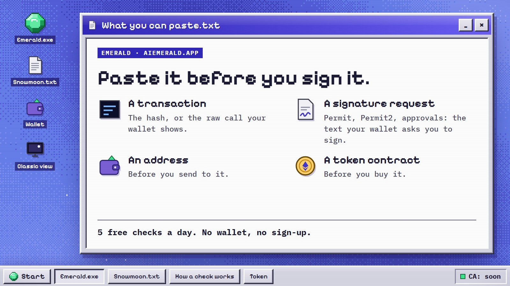
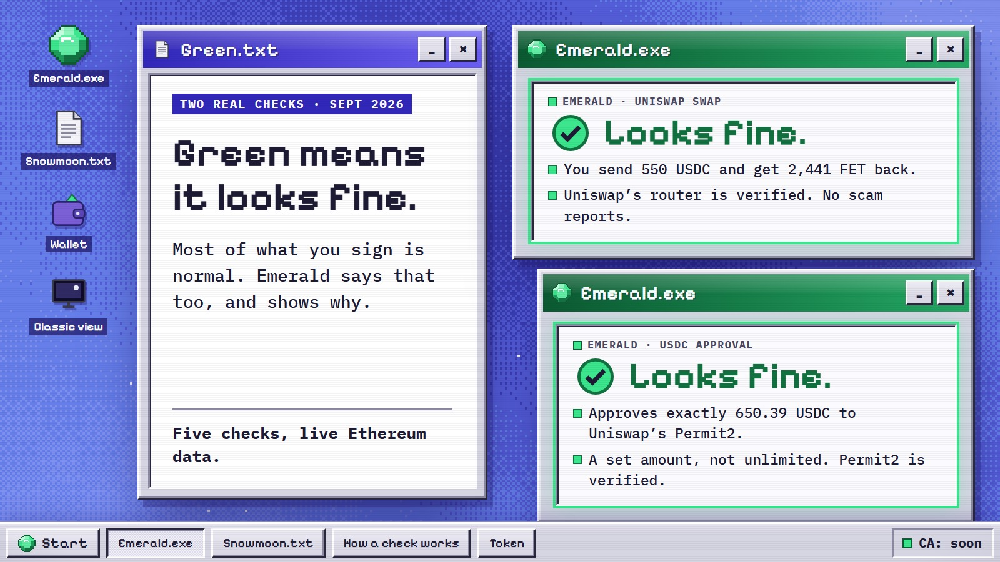
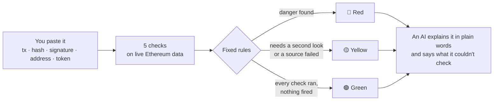
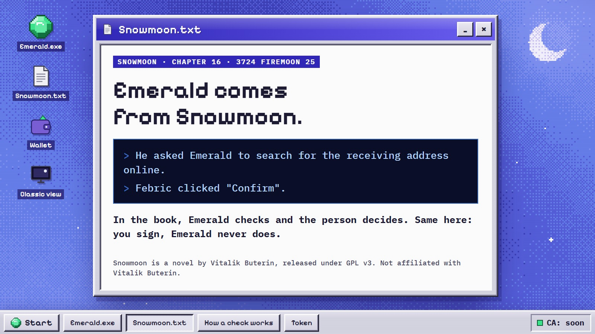

<p align="center">
  
</p>

<h1 align="center">Emerald</h1>

<p align="center">
  <b>Know what you're signing.</b><br>
  Paste what your wallet asks you to sign. Emerald checks it on live Ethereum data and tells you in plain words what it does.
</p>

<p align="center">
  <a href="https://aiemerald.app"><b>aiemerald.app</b></a> ·
  <a href="https://x.com/emeraldaieth">X @emeraldaieth</a> ·
  <a href="#contracts-and-addresses">Contracts</a> ·
  <a href="#real-cases">Real cases</a> ·
  <a href="#run-it-locally">Run it locally</a>
</p>

<p align="center">
  
  
  
  
</p>

---

## In one minute

| | |
|---|---|
| **What you paste** | A transaction, a transaction hash, a signature request (Permit, Permit2, Seaport), an address, or a token contract. |
| **What Emerald does** | Runs five checks on live Ethereum data, turns the results into 🟢 green, 🟡 yellow or 🔴 red, and explains why. |
| **What it never does** | Ask you to sign anything, or touch your keys. |
| **Cost** | 5 free checks a day. No wallet, no sign-up. More for $EMERALD holders. |
| **Where** | Ethereum mainnet only. |

> [!WARNING]
> **Not audited. Emerald can be wrong.** Always read the reasons before you sign.

<p align="center">
  
  
</p>

## How a check works



**The AI can't change the color.** Only the rules set it, so the same input always gets the same color.

| Check | What it looks at | Data |
|---|---|---|
| `decode` | what the call or the signature actually does | Sourcify v2 ABIs, openchain signatures |
| `simulate` | what leaves your wallet and what comes in | `eth_simulateV1` with `traceTransfers` |
| `poisoning` | lookalike addresses in your wallet's history | Blockscout v2 |
| `labels` | scam reports, verification, contract age, ENS | Blockscout v2, GoPlus |
| `token` | honeypots and tokens that can't be sold | GoPlus |

### What each color means

| | When |
|---|---|
| 🔴 **Red** | A check found danger: a reported address, a lookalike of an address you used before, an unlimited approval or `setApprovalForAll` to a plain wallet or an unverified contract, a Permit or Permit2 to an unknown spender, a simulation where assets leave and nothing comes back, a token that can't be sold. |
| 🟡 **Yellow** | Something needs a second look, or a data source failed: an unverified contract, one less than 7 days old, an unlimited approval to a verified contract, a first interaction. |
| 🟢 **Green** | Every check ran and none of them fired. A check with missing data is never green. |

The AI gets the verdict and the outside data (marked as untrusted), answers in the language you wrote in, and always
ends with a line that starts with `Couldn't check:`.

## Where the name comes from

Emerald comes from *Snowmoon*, a novel by Vitalik Buterin released under GPL v3
(https://vitalik.eth.limo/snowmoon/). In the book, Emerald checks and the person decides. Same here: you sign,
Emerald never does. **Not affiliated with Vitalik Buterin.**

<p align="center">
  
</p>

## The token

$EMERALD launches on [Stockereum](https://stockereum.com) (Ethereum) with a **2 % fee per trade** and fees to holders off.

| Where every trade fee goes | Share |
|---|---|
| Emerald checks: claimed by the creator wallet to pay for the AI and the data | **1 %** |
| Stockereum, the launch platform | **1 %** |
| **Total** | **2 %** |

During the first 20 seconds after launch, Stockereum's anti-snipe fee is higher. The creator share stays at 1 % and
the rest goes to Stockereum. The site shows a live counter of the fees and of what the checks cost.

| Checks per day | Who |
|---|---|
| 5 | anyone, no wallet needed |
| 100 | holders of 100k $EMERALD |
| no daily limit (fair use) | holders of 1M $EMERALD |

When the daily spend cap is reached, the 5 free checks pause until the next day. Holders keep their checks.

### Contracts and addresses

| What | Address | Why it matters |
|---|---|---|
| **$EMERALD token** | **CA: soon** | Posted on [X](https://x.com/emeraldaieth) and on the site at launch. Paste it into Emerald: the real one answers "This is me." |
| Stockereum launch factory | [`0xc6B0…977B`](https://etherscan.io/address/0xc6B080DEd03C3382476A76345e79f82BD480977B) | Deploys the token and its pool. The verifier reads the launch hook from it (`hook()`). |
| Stockereum fee escrow | [`0xAcef…24BA`](https://etherscan.io/address/0xAcefe251da006887dA41C063D06CC82A060824BA) | Holds the trade fees until the creator wallet claims them for the checks. |
| WETH | [`0xC02a…6Cc2`](https://etherscan.io/address/0xC02aaA39b223FE8D0A0e5C4F27eAD9083C756Cc2) | The pool's quote token. |
| Permit2 | [`0x0000…8BA3`](https://etherscan.io/address/0x000000000022D473030F116dDEE9F6B43aC78BA3) | Uniswap's signature-approval contract, used in the signature checks. |

<details>
<summary>Full addresses</summary>

```text
Stockereum launch factory  0xc6B080DEd03C3382476A76345e79f82BD480977B
Stockereum fee escrow      0xAcefe251da006887dA41C063D06CC82A060824BA
WETH                       0xC02aaA39b223FE8D0A0e5C4F27eAD9083C756Cc2
Permit2                    0x000000000022D473030F116dDEE9F6B43aC78BA3
```

</details>

The interfaces are in `launch/src/Stockereum.sol`, copied from the sources verified on Sourcify. Check it yourself:

```bash
# the fee split, on a fork of mainnet (needs Foundry)
cd launch && MAINNET_RPC_URL=https://ethereum-rpc.publicnode.com forge test -vv
# the live token, read-only: never signs or sends anything
npx tsx scripts/verify-launch.ts --token <CA> --creator <creator wallet>
```

## Real cases

Every case below is a real mainnet transaction, signature or address (or a transaction built from a real one, where
it says so). The responses of every data source were recorded, and `npm test` runs the engine on them and checks the
color. Each case lives in `engine/test/fixtures/cases/` with a `why` field that explains where it comes from.

| | Case | What it is |
|---|---|---|
| 🟢 | `swap-uniswap-universal-router-txhash` | A normal swap of 550 USDC for FET on Uniswap's Universal Router. [tx](https://etherscan.io/tx/0x020419afcdb33f575ba84361e3125b832c11a2d22fc187132a87a4b4baa02f8e) |
| 🟢 | `approve-exact-usdc-to-permit2` | An approval of exactly 650.389675 USDC to Permit2, the amount the wallet had just received. [wallet](https://etherscan.io/address/0x72Fc85Bab23E46c2434A91e7B5250c959e667e6f) |
| 🟡 | `permit2-single-uniswap-universal-router` | The Permit2 signature the Uniswap app asked for in that swap: a known router, but an unlimited amount. [spender](https://etherscan.io/address/0x23617e59A5925b2A4Bf75d73ff6711cD0b29De85) |
| 🟡 | `address-vitalik-eth-eip7702` | A well-known clean address with an EIP-7702 delegation, pasted with no wallet to compare against, so lookalikes can't be checked. [address](https://etherscan.io/address/0xd8dA6BF26964aF9D7eEd9e03E53415D37aA96045) |
| 🟡 | `poisoning-wbtc-68m-legit-counterparty` | The real 0.05 ETH test send from the May 2024 WBTC poisoning victim to their real counterparty. It is not red, but two lookalikes of it sit in the history. [counterparty](https://etherscan.io/address/0xd9A1b0B1e1aE382DbDc898Ea68012FfcB2853a91) |
| 🔴 | `poisoning-wbtc-68m-flagged-lookalike` | The calldata of the May 2024 theft of 1155.28802767 WBTC, sent to a poisoned lookalike address. [lookalike](https://etherscan.io/address/0xd9A1C3788D81257612E2581A6ea0aDa244853a91) |
| 🔴 | `poisoning-wbtc-68m-unflagged-lookalike` | The same transfer built for a second lookalike from the same victim's history, one that no source reports. [lookalike](https://etherscan.io/address/0xD9A192566e41e0804C3D81588a2D15Be58853a91) |
| 🔴 | `permit2-batch-inferno-drainer` | The Permit2 signature a victim gave to an Inferno Drainer address: an unlimited USDC amount, valid for 7 years. The drainer used it and took the victim's USDC one block later. [spender](https://etherscan.io/address/0x00001f78189bE22C3498cFF1B8e02272C3220000) |
| 🔴 | `txhash-permit2-drain-inferno-drainer` | That next transaction: the drainer moves the victim's USDC through Permit2, split 80/20. [tx](https://etherscan.io/tx/0x00693cdac4fa8b0f4a30ffc9277ab42f3cfecbcaa3fa32cfb7b10add9a6a7730) |
| 🔴 | `txhash-setapprovalforall-inferno-drainer` | `setApprovalForAll` on an NFT collection to the same drainer address. [tx](https://etherscan.io/tx/0xed8432c64e61b6c896d8964fc0013daa0853704e963b21595a7d359362877fe9) |
| 🔴 | `txhash-nft-approve-inferno-drainer` | An `approve` of one NFT to the same drainer. Same selector as an ERC-20 approve, but the second argument is a token id. [tx](https://etherscan.io/tx/0x0f076bf8690c685bdd5f8f44d3d19425367926125ef5c8fbc3215dfde2d1c029) |
| 🔴 | `approve-unlimited-usdc-to-eoa` | Built: an unlimited USDC approval to a plain wallet with no reports, to test the rule on its own. |
| 🔴 | `token-psyop-honeypot` | $PSYOP, a known 2023 honeypot. Only GoPlus flags it. [token](https://etherscan.io/address/0x4680bdc9af57523f85d75499133f4e6633ac0ead) |
| 🔴 | `token-snt-goplus-honeypot-false-positive` | SNT, a legitimate long-standing token that GoPlus currently marks as a honeypot, most likely a false positive. The rule follows the source, and the explanation says which source raised it. [token](https://etherscan.io/address/0x744d70FDBE2Ba4CF95131626614a1763DF805B9E) |

## Run it locally

Node 24.

```bash
git submodule update --init   # forge-std, only for the launch tests
npm ci
cp .env.example .env    # ANTHROPIC_API_KEY and SESSION_SECRET; without Upstash the local API keeps state in memory
npm test                # the whole suite, offline: recorded responses, no keys needed
npx tsc --noEmit        # typecheck
npm run dev:api         # /api on http://localhost:8787 (same handlers as Vercel)
npm run dev             # the site on http://localhost:5173, /api proxied to :8787
npm run dev:mock        # or: the site with a mock /api, no keys needed
```

The Solidity tests run with `cd launch && forge test`. Without `MAINNET_RPC_URL` the fork tests are skipped.

### What's in the repo

| Folder | What it is |
|---|---|
| `engine/` | the five checks and the rules that set the color, with the recorded real cases |
| `server/`, `api/` | the API on Vercel: streaming verdicts, sign-in with Ethereum, daily checks, spend cap |
| `web/` | the site: Emerald.exe, the room, and the classic view |
| `launch/` | Foundry tests of the Stockereum fee split on a mainnet fork |
| `scripts/` | the read-only launch verifier and the live smoke tests |
| `kit/` | the images and clips for X, rendered from code |

## License

AGPL-3.0-only. See [`LICENSE`](LICENSE).
